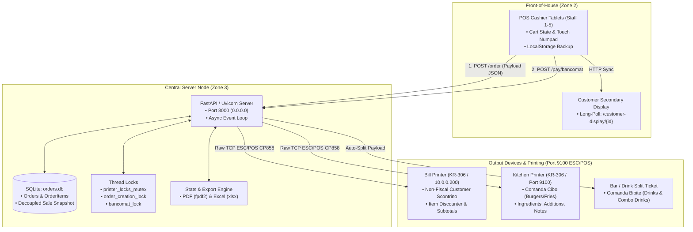

# GRAPHIC OVERVIEW & VISUAL SPECIFICATION: BURGER STATION POS

> **Purpose:** This document provides comprehensive, production-ready visual design instructions and prompt specifications for an AI agent (or visual designer / image generation model) to generate an infographic/diagram that overlays the **Burger Station POS software functionalities & network architecture** onto a **top-down / isometric place map of an open-field festival restaurant**.

---

## 1. Executive Summary & Design Vision

The graphic must blend **two distinct dimensions** into a single, cohesive visual blueprint:
1. **Physical Spatial Layer (Open-Field Restaurant):** An open-air festival/field food venue featuring outdoor cashier tents, central control booth, open kitchen line, bar/drink station, numbered picnic seating area, and takeaway pickup zone.
2. **Digital & Network Infrastructure Layer (Software System):** Overlaid schematic representations of the POS tablets, central FastAPI server, SQLite database, thermal network printers, customer display screens, and live ESC/POS / HTTP data streams derived from `main.py` and `printing.py`.

### Visual Style & Aesthetic Requirements
- **Perspective:** Isometric 3D (30-degree projection) or Clean 2.5D Technical Map with subtle depth and elevation.
- **Theme/Mood:** Modern "Dark UI / Cyber-Festival" or "Clean Architectural Blueprint with Glowing Neon Data Traces".
- **Color Palette:**
  - **Background / Ground:** Deep slate / dark grass texture (`#0F172A` / `#1E293B`) or soft architectural grid (`#F8FAFC` if light mode).
  - **Front-of-House / POS Terminals:** Cyber Teal / Cyan (`#06B6D4` / `#22D3EE`).
  - **Central Server & Core DB:** Neon Amber / Gold (`#F59E0B` / `#FBBF24`).
  - **Kitchen & Grill (Comande Cibo):** Warm Crimson / Flame Orange (`#EF4444` / `#F97316`).
  - **Bar / Drink Station (Comande Bibite):** Electric Indigo / Ice Blue (`#6366F1` / `#38BDF8`).
  - **Seating & Takeaway Areas:** Emerald Green (`#10B981` / `#34D399`).
- **Visual Clarity:** Clear callout boxes, glowing vector connection lines (dashed for Wi-Fi/HTTP, solid pulsing for Raw TCP/IP 9100 printing), and descriptive iconography for each hardware and software component.

---

## 2. Spatial Layout & Venue Zones (The Place Map)

```
+-----------------------------------------------------------------------------------------+
|                                    OPEN FIELD RESTAURANT MAP                            |
+-----------------------------------------------------------------------------------------+
|                                                                                         |
|   [ ZONE 1: ENTRANCE & QUEUE ]         [ ZONE 2: FRONT-OF-HOUSE POS STATIONS ]          |
|   - Customer Queue Lines               - 5x POS Cashier Tablets (Staff 1-5)             |
|   - Digital Menu Displays              - 5x Customer-Facing Display Screens             |
|                                        - 1x Shared Bancomat / POS Pinpad                |
|                                        - 1-2x Front Bill Printers (10.0.0.200)          |
|                                                          |                              |
|                                             (Wi-Fi / LAN HTTP REST)                     |
|                                                          v                              |
|                             +----------------------------------------------+            |
|                             | ZONE 3: CENTRAL SERVER & ADMIN HUB (HQ TENT) |            |
|                             | - Uvicorn/FastAPI Server (0.0.0.0:8000)      |            |
|                             | - SQLite DB (`orders.db` + WAL Cache)        |            |
|                             | - Admin Console (Editor Menu, Live Stats)    |            |
|                             | - Network Switch & High-Gain Wi-Fi AP        |            |
|                             +----------------------------------------------+            |
|                                            /                \                           |
|                      (Raw TCP Port 9100)  /                  \  (Raw TCP Port 9100)     |
|                                          v                    v                         |
|   [ ZONE 4: KITCHEN & GRILL ]                   [ ZONE 5: BAR & BEVERAGE STATION ]     |
|   - Thermal ESC/POS Kitchen Printer             - Thermal ESC/POS Bar Printer           |
|     (Target: Burger/Food Comanda)                 (Target: Bibite / Drinks Comanda)     |
|   - Prep Line, Grills, Fryers                   - Draft Taps, Bottled Soda Fridges      |
|   - Kitchen Display Screen (KDS)                - Drink Pickup Window                   |
|                                                                                         |
|                                                                                         |
|   [ ZONE 6: TAKEAWAY PICKUP (ASPORTO) ]         [ ZONE 7: OPEN-AIR SEATING (TAVOLI) ]   |
|   - Order Calling Screen / Counter              - Numbered Picnic Tables (Tavolo 1..N)  |
|   - Bagging & Order Assembly                    - Festival Canopies & String Lights     |
|                                                                                         |
+-----------------------------------------------------------------------------------------+
```

### Detailed Zone Descriptions

#### Zone 1: Customer Queue & Entrance
- **Visuals:** Stanchions with guide ropes, illuminated wooden/metal menu boards displaying categories (`panini`, `menu`, `contorni`, `bibite`, `dolci`).
- **Data Flow Anchor:** Origin of customer demand.

#### Zone 2: Cashier Tents / Ordering Stations (Staff 1–5)
- **Visuals:** Five covered wooden counters with touch tablet stands running the POS UI (`index.html`).
- **Hardware per Station:**
  - Touch Tablet / iPad running Vanilla JS / Tailwind interface.
  - Secondary swivel monitor for Customer Display (`/customer-display/{user_id}`).
  - Local Bill Printer (Network/IP: `192.168.1.101` to `192.168.1.105` or default `10.0.0.200`).
  - Shared Bancomat / Contactless terminal with simulated lock indicator (`/pay/bancomat`).
- **Functionality Callout:**
  - Real-time `localStorage` offline safety buffer.
  - Live Cart Sync (`POST /users/{user_id}/cart`).
  - Active staff switcher & custom order discounts (% or €).

#### Zone 3: Central Server & Management HQ Tent
- **Visuals:** A weather-resistant tech hub tent containing the main server station, UPS battery backup, gigabit network switch, and high-throughput outdoor Wi-Fi access point (AP).
- **Core Server Elements:**
  - **FastAPI Engine (`main.py`):** Asynchronous request router running on port 8000.
  - **SQLite Database (`orders.db`):** Tables `users`, `categories`, `menu_items`, `orders`, `order_items`, `system_settings`.
  - **Concurrency & Lock Managers:** `printer_locks_mutex`, `order_creation_lock`, `bancomat_lock`.
  - **Admin Laptop:** Displaying `editor.html` (Menu & Category CRUD), `stats.html` (hourly volume, revenue analytics, Excel/PDF exporter).

#### Zone 4: Kitchen & Cook Line (Cucina)
- **Visuals:** Heavy-duty outdoor grills, fryers, burger assembly station, heat lamps.
- **Hardware & Flow:**
  - **Thermal ESC/POS Kitchen Printer (IP: `10.0.0.200` / Port 9100):** Prints food tickets with big bold headers:
    - Order Number (`ORDINE 042`), Timestamp, Table Number (`TAVOLO 12`) or `>>> ASPORTO <<<`.
    - Item modifications (`[Ingr: Senza Cipolla, Con Bacon Extra]`, `*Nota: Ben cotto`).
    - Excludes drinks (filtered out via `category != 'bibite'`).

#### Zone 5: Bar & Beverage Dispense Station (Banco Bibite)
- **Visuals:** Fast-pour beer taps, refrigeration units, glass racks.
- **Hardware & Flow:**
  - Automated split receipt generation: `printing.py` extracts standalone drinks + combo drinks (e.g. Coca Cola / Birra chosen inside `Menu Classico`) into a dedicated **Comanda Bar/Bibite** ticket.

#### Zone 6: Takeaway Pickup Station (`ASPORTO`)
- **Visuals:** Dedicated counter labeled "RITIRO ASPORTO" with staged takeaway paper bags stamped with large order numbers.

#### Zone 7: Open-Air Dining Area (`TAVOLI`)
- **Visuals:** Large grassy meadow with rustic wooden picnic tables labeled with clear table numbers (`Tavolo 1`, `Tavolo 2`, etc.), overhead festival fairy lights, and seating clusters.

---

## 3. Digital Overlay: Code Functionalities & Data Stream Mapping

The graphic must depict the exact software communication paths as glowing directional arrows and circuit lines:



### Data Payload Annotations to Highlight on the Graphic
1. **Order Dispatch Payload (JSON):**
   ```json
   {
     "user_id": 1,
     "table_number": "14",
     "takeaway": false,
     "items": [{"description": "Panino Classico", "price": 9.0, "ingredients": "-Cipolla +Bacon"}],
     "total": 14.00,
     "payment_method": "Contanti"
   }
   ```
2. **Printing Locks & Safety Protocol:**
   - Pre-check `paper_status()` (detect `CARTA ESAURITA` out-of-paper sensor).
   - Thread lock release on completion with CP858 charset encoding.

---

## 4. Visual Component Matrix & Iconography Guide

| Component | Visual Representation / Icon | Color Code | Attached Label & Tech Specs |
| :--- | :--- | :--- | :--- |
| **POS Terminal** | Sleek 10" Tablet on swivel stand with shopping cart UI badge | `#06B6D4` (Cyan) | `Terminal POS (Staff #)`<br>`Vue/VanillaJS + Tailwind` |
| **Customer Display** | Mini horizontal screen facing outward with live subtotal | `#38BDF8` (Sky) | `Customer Display`<br>`Long-polling: /customer-display` |
| **Central Server** | 1U Rack / Mini-PC tower with glowing activity LEDs & DB cylinder | `#F59E0B` (Amber) | `FastAPI Core Server`<br>`Uvicorn 0.0.0.0:8000` |
| **SQLite Database** | Stacked glowing disk cylinder with ledger glyph | `#D97706` (Bronze) | `orders.db (SQLite)`<br>`Decoupled Ledger Pattern` |
| **Bill Printer** | Thermal receipt printer with paper receipt spooling out | `#10B981` (Green) | `Bill Printer`<br>`ESC/POS CP858 • Scontrino` |
| **Kitchen Printer** | Heavy-duty steel thermal printer with red order slip | `#EF4444` (Red) | `Kitchen Printer`<br>`Raw TCP 9100 • Comanda Cibo` |
| **Bar Ticket Print** | Compact thermal printer with beverage / beer mug glyph | `#6366F1` (Indigo) | `Beverage Print Split`<br>`Auto-extracted Combo Drinks` |
| **Admin / Stats Hub** | Laptop showing live bar charts and export icons (PDF/XLS) | `#8B5CF6` (Purple) | `Admin Dashboard`<br>`StatsExporter & Menu CRUD` |
| **Wi-Fi / Network AP** | Outdoor pole-mounted Omni Antenna radiating signal waves | `#E2E8F0` (White) | `High-Gain Wi-Fi Mesh`<br>`Subnet 192.168.1.0/24` |

---

## 5. Ready-to-Use Generative AI Prompts (For DALL-E, Midjourney & Stable Diffusion)

### Prompt Option A: Isometric Technical 3D Architectural Infographic (Recommended)
```text
Detailed 3D isometric architectural infographic of an open-field festival restaurant called "Burger Station", high-tech food festival concept, clean isometric cutaway. In the center: outdoor festival grounds with wooden counters, outdoor kitchen with smoke grills, drink bar, and picnic tables. Overlaid with glowing holographic data streams and technical HUD callouts: 5 touchscreen POS cashier tablets connected via cyan Wi-Fi beams to a glowing amber central server hub in an admin tent. Glowing orange data lines routed from the server to red thermal network receipt printers in the kitchen spitting out order tickets, and green lines to customer receipt printers at the cashier. Modern tech aesthetic, Unreal Engine 5 render style, soft ambient lighting, clean UI overlay, dark slate ground with glowing circuit traces, 8k resolution, photorealistic volumetric lighting, ultra-detailed schematic.
```

### Prompt Option B: Modern 2.5D Vector Floorplan Blueprint
```text
Top-down 2.5D vector architectural blueprint and network topology map of an open-air burger restaurant. Minimalist cyberpunk blueprint style, dark navy background with electric cyan, amber gold, and flame red vector lines. Clearly partitioned areas: Ordering Station with 5 tablet kiosks, Central Server Hub with database icon, Kitchen Line with grill and kitchen ticket printer, Beverage Bar with draft taps, and Picnic Table Meadow. Flowing dashed neon arrows showing HTTP REST JSON data from ordering terminals to the central server, and solid neon lines showing Raw ESC/POS port 9100 printing streams to thermal printers. Clean typography labels, sleek UI dashboard icons, tech infographic, crisp vector art, high contrast.
```

### Prompt Option C: Cinematic Cyber-Rustic Scene (Presentation Hero Image)
```text
Wide-angle cinematic isometric view of a bustling night food festival burger station situated in an open grassy park. Warm fairy lights hanging over rustic wooden picnic tables. In the foreground: modern wooden cashier counter with illuminated tablet POS screens showing burger menus and order carts. Visible digital holographic network overlay highlighting data pathways connecting tablets, a central server terminal inside a branded tent, and high-speed thermal printers ejecting paper receipts at the grill and bar stations. Atmospheric smoke, shallow depth of field, vibrant colors, premium commercial concept art.
```

---

## 6. Diagramming Instructions for Mermaid / PlantUML Agents

When rendering this architecture via vector or markdown diagramming tools, use the following layout directives:
- **Grouping:** Use 3 distinct container blocks: `Front-of-House (Client Devices)`, `Central Operations Node (Backend & DB)`, and `Production Lines (Kitchen, Bar & Receipt Printers)`.
- **Styling:**
  - Apply class `posStation` with fill `#0e7490`, stroke `#22d3ee`, color `#ffffff`.
  - Apply class `serverCore` with fill `#78350f`, stroke `#f59e0b`, color `#ffffff`.
  - Apply class `printerNode` with fill `#7f1d1d`, stroke `#ef4444`, color `#ffffff`.
- **Edge Labels:** Always specify protocol (`HTTP REST / JSON`, `SSE / Long-Poll`, `TCP 9100 ESC/POS`).

---

## 7. Verification Checklist for the AI Graphic Generator

Before finalizing the graphical representation, verify that the following key code-driven details are visibly represented:
- [ ] **Staff 1–5 Terminals:** Visible 5 cashier touchpoints with independent cart state tracking.
- [ ] **Dual Printing Paths:** Separate visual paths for Customer Bill (`print_bill`) and Kitchen Ticket (`print_kitchen_receipt`).
- [ ] **Automatic Drink Extraction:** Indication that drinks (standalone + combo choices) are split cleanly into bar tickets.
- [ ] **Customer-Facing Display:** Visual link between cashier terminal and customer screen.
- [ ] **Decoupled Central Server:** Centralized SQLite ledger & FastAPI server acting as the single source of truth.
- [ ] **Venue Mapping:** Clearly identifiable kitchen, bar, seating tables, cashier line, and takeaway pickup zone.
